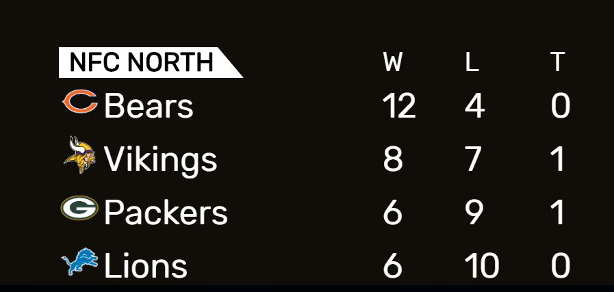

# MMM-MyStandings
MagicMirror module to get ESPN standings for the major US sports
# MMM-MyStandings
MagicMirror module to get ESPN standings for the major US sports.  I was inspired by MMM-MyScoreboard and figured that this will compliment it nicely.
The module will rotate through different sports.  If you only want to show one sport or one division, the module will just display one without rotating.

## API
Uses the ESPN API for sports standings

## Preview


## Installing the module
Go to your MagicMirror modules directory by entering `cd MagicMirror/modules`

run `git clone https://github.com/vincep5/MMM-MyStandings`

run `cd MMM-MyStandings` to get into the newly created folder

run `npm install` to install the dependencies

## Config
Add `MMM-MyStandings` module to the `modules` array in the `config/config.js` file:
````javascript
modules: [
  {
		module: "MMM-MyStandings",
		position: "top_right",
		config: {
			updateInterval: 60 * 60 * 1000, // every 60 minutes
			rotateInterval: 1 * 60 * 1000, // every 1 minute
			sports: [
				{ league: "NBA", groups: ["Atlantic", "Central", "Southeast", "Northwest", "Pacific", "Southwest"] },
				{ league: "MLB", groups: ["American League East", "American League Central", "American League West", "National League East", "National League Central", "National League West"] },
				{ league: "NFL", groups: ["AFC East", "AFC North", "AFC South", "AFC West", "NFC East", "NFC North", "NFC South", "NFC West"] },
				{ league: "NHL", groups: ["Atlantic Division", "Metropolitan Division", "Central Division", "Pacific Division"] },
				{ league: "MLS", groups: ["Eastern Conference", "Western Conference"] },
				{ league: "NCAAF", groups: ["American Athletic - East", "American Athletic - West", "Atlantic Coast Conference - Atlantic", "Atlantic Coast Conference - Coastal",
										"Big 12 Conference", "Big Ten - East", "Big Ten - West", "Conference USA - East", "Conference USA - West",
										"FBS Independents", "Mid-American - East", "Mid-American - West", "Mountain West - Mountain", "Mountain West - West",
										"Pac 12 - North", "Pac 12 - South", "SEC - East", "SEC - West", "Sun Belt - East", "Sun Belt - West"] }
				{ league: "NCAAM", groups: ["America East Conference", "American Athletic Conference", "Atlantic 10 Conference", "Atlantic Coast Conference", "Atlantic Sun Conference",
										"Big 12 Conference", "Big East Conference", "Big Sky Conference", "Big South Conference",
										"Big Ten Conference", "Big West Conference", "Colonial Athletic Association", "Conference USA",
										"Horizon League", "Ivy League", "Metro Atlantic Athletic Conference", "Mid-American Conference",
										"Mid-Eastern Athletic Conference", "Missouri Valley Conference", "Mountain West Conference", "Northeast Conference",
										"Ohio Valley Conference", "Pac-12 Conference", "Patriot League", "Southeastern Conference",
										"Southern Conference", "Southland Conference", "Southwestern Athletic Conference", "Summit League",
										"Sun Belt Conference", "West Coast Conference", "Western Athletic Conference"] }
			],
			nameStyle: "short",
			showLogos: true,
			useLocalLogos: true,
			showByDivision: true,
			fadeSpeed: 2000,
		}
  }
]
````

| Option | Description
| ------- |  -------
| updateInterval | 60 * 60 * 1000 // every 60 minutes <br> Time in milliseconds to update data from ESPN
| rotateInterval | 1 * 60 * 1000 // every 1 minute <br> Time in milliseconds to rotate through the leagues or divisions
| nameStyle | "abbreviation", "full", or <b>"short" </b> <br> Display abbreviation, full name, or short name for the team
| showLogos | <b>true</b> or false <br> Display logos (true) or not (false)
| useLocalLogos | <b>true</b> or false <br> Display logos from folder (true) or display logos from the ESPN url (false) <br> Most of the logos are the same from MMM-MyScoreboard
| showByDivision | <b>true</b> or false <br> Show the standings by division (true) or everything at once (false)
| fadeSpeed | 2000 <br> Time in milliseconds to display the module


## Additional Soccer Leagues
If your soccer competition has groups and you want to see groups rotate, consider this as your config
````javascript
{ league: "FIFA_WORLD_CUP", groups: ["GROUP A"] }, //only show group A
{ league: "UEFA_CHAMPIONS", groups: ["GROUP A", "GROUP B", "GROUP C", "GROUP D", "GROUP E", "GROUP F", "GROUP G", "GROUP H"] }
````
else you can just configure leagues without groups like this
````javascript
{ league: "ENG_PREMIERE_LEAGUE" }
````

````javascript
	//International Soccer
	"AFC_ASIAN_CUP"
	"AFC_ASIAN_CUP_Q"
	"AFF_CUP"
	"AFR_NATIONS_CUP"
	"AFR_NATIONS_CUP_Q"
	"AFR_NATIONS_CHAMPIONSHIP"
	"CONCACAF_GOLD_CUP"
	"CONCACAF_NATIONS_Q"
	"CONCACAF_WOMENS_CHAMPIONSHIP"
	"CONMEBOL_COPA_AMERICA"
	"FIFA_CLUB_WORLD_CUP"
	"FIFA_CONFEDERATIONS_CUP"
	"FIFA_MENS_OLYMPICS"
	"FIFA_WOMENS_OLYMPICS"
	"FIFA_WOMENS_WORLD_CUP"
	"FIFA_WORLD_CUP"
	"FIFA_WORLD_CUP_Q_AFC"
	"FIFA_WORLD_CUP_Q_CAF"
	"FIFA_WORLD_CUP_Q_CONCACAF"
	"FIFA_WORLD_CUP_Q_CONMEBOL"
	"FIFA_WORLD_CUP_Q_OFC"
	"FIFA_WORLD_CUP_Q_UEFA"
	"FIFA_WORLD_U17"
	"FIFA_WORLD_U20"
	"UEFA_CHAMPIONS"
	"UEFA_EUROPA"
	"UEFA_EUROPEAN_CHAMPIONSHIP"
	"UEFA_EUROPEAN_CHAMPIONSHIP_Q"
	"UEFA_EUROPEAN_CHAMPIONSHIP_U19"
	"UEFA_EUROPEAN_CHAMPIONSHIP_U21"
	"UEFA_NATIONS"
	"SAFF_CHAMPIONSHIP"
	"WOMENS_EUROPEAN_CHAMPIONSHIP"

	//UK/Ireland Soccer
	"ENG_CHAMPIONSHIP"
	"ENG_EFL"
	"ENG_LEAGUE_1"
	"ENG_LEAGUE_2"
	"ENG_NATIONAL"
	"ENG_PREMIERE_LEAGUE"
	"IRL_PREM"
	"NIR_PREM"
	"SCO_CIS"
	"SCO_CHAMPIONSHIP"
	"SCO_LEAGUE_1"
	"SCO_LEAGUE_2"
	"SCO_PREM"
	"WAL_PREM"

	//European Soccer
	"AUT_BUNDESLIGA"
	"BEL_DIV_A"
	"DEN_SAS_LIGAEN"
	"ESP_LALIGA"
	"ESP_SEGUNDA_DIV"
	"FRA_LIGUE_1"
	"FRA_LIGUE_2"
	"GER_2_BUNDESLIGA"
	"GER_BUNDESLIGA"
	"GRE_SUPER_LEAGUE"
	"ISR_PREMIER_LEAGUE"
	"ITA_SERIE_A"
	"ITA_SERIE_B"
	"MLT_PREMIER_LEAGUE"
	"NED_EERSTE_DIVISIE"
	"NED_EREDIVISIE"
	"NOR_ELITESERIEN"
	"POR_LIGA"
	"ROU_FIRST_DIV"
	"RUS_PREMIER_LEAGUE"
	"SUI_SUPER_LEAGUE"
	"SWE_ALLSVENSKANLIGA"
	"TUR_SUPER_LIG"

	//South American Soccer
	"ARG_COPA"
	"ARG_NACIONAL_B"
	"ARG_PRIMERA_DIV_B"
	"ARG_PRIMERA_DIV_C"
	"ARG_PRIMERA_DIV_D"
	"ARG_SUPERLIGA"
	"BOL_LIGA_PRO"
	"BRA_CAMP_CARIOCA"
	"BRA_CAMP_GAUCHO"
	"BRA_CAMP_MINEIRO"
	"BRA_CAMP_PAULISTA"
	"BRA_SERIE_A"
	"BRA_SERIE_B"
	"BRA_SERIE_C"
	"CHI_PRIMERA_DIV"
	"COL_PRIMERA_A"
	"COL_PRIMERA_B"
	"CONMEBOL_COPA_LIBERTADORES"
	"CONMEBOL_COPA_SUDAMERICANA"
	"ECU_PRIMERA_A"
	"PAR_PRIMERA_DIV"
	"PER_PRIMERA_PRO"
	"URU_PRIMERA_DIV"
	"VEN_PRIMERA_PRO"

	//North American Soccer
	"CONCACAF_CHAMPIONS"
	"CONCACAF_LEAGUE"
	"CRC_PRIMERA_DIV"
	"GUA_LIGA_NACIONAL"
	"HON_PRIMERA_DIV"
	"JAM_PREMIER_LEAGUE"
	"MEX_ASCENSO_MX"
	"MEX_COPA_MX"
	"MEX_LIGA_BANCOMER"
	"SLV_PRIMERA_DIV"
	"USA_MLS"
	"USA_NCAA_SL_M"
	"USA_NCAA_SL_W"
	"USA_NASL"
	"USA_NWSL"
	"USA_OPEN"
	"USA_USL"

	//Asian Soccer
	"AFC_CHAMPIONS"
	"AUS_A_LEAGUE"
	"CHN_SUPER_LEAGUE"
	"IDN_SUPER_LEAGUE"
	"IND_I_LEAGUE"
	"IND_SUPER_LEAGUE"
	"JPN_J_LEAGUE"
	"MYS_SUPER_LEAGUE"
	"SGP_PREMIER_LEAGUE"
	"THA_PREMIER_LEAGUE"

	//African Soccer
	"CAF_CHAMPIONS"
	"CAF_CONFED_CUP"
	"GHA_PREMIERE_LEAGUE"
	"KEN_PREMIERE_LEAGUE"
	"NGA_PRO_LEAGUE"
	"RSA_FIRST_DIV"
	"RSA_PREMIERSHIP"
	"UGA_SUPER_LEAGUE"
	"ZAM_SUPER_LEAGUE"
	"ZIM_PREMIER_LEAGUE"
````

## Alternate ways of showing sports
````javascript
		sports: [
			{ league: "NFL" },
			{ league: "NHL", groups: ["Central Division"] }
		]
````
This will rotate ALL NFL and only NHL's Central Division
